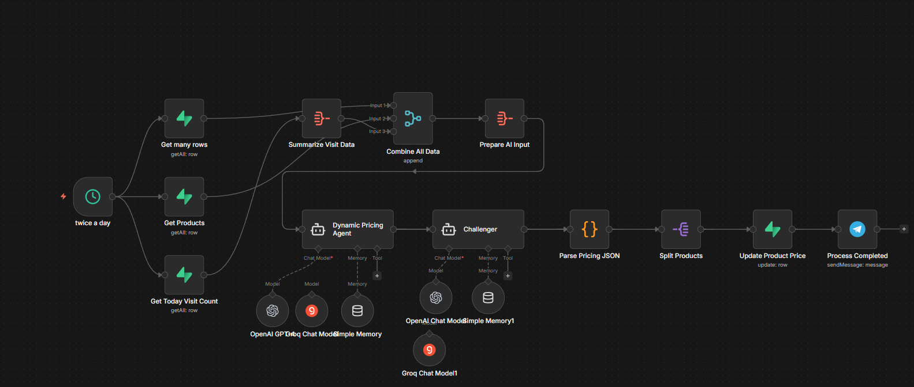
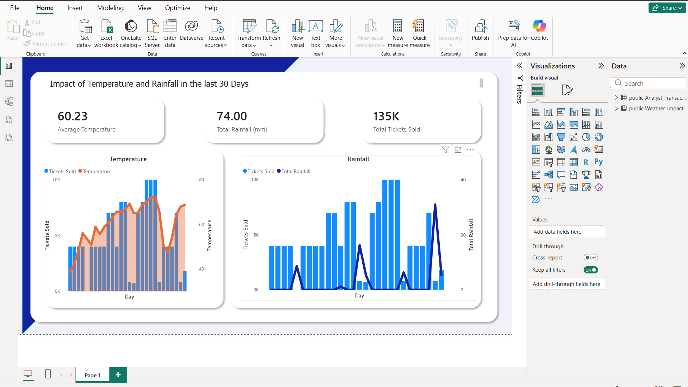

# Portfolio Website

This repository contains a static personal portfolio website with a dedicated blog page. The site is designed to be lightweight, fast, and easy to deploy, using plain HTML, CSS, and JavaScript.

## Website Overview

The website has three core views:

- **Home page** (`index.html`) — the main landing experience.
- **Projects page** (`projects.html`) — a curated overview of selected work.
- **Blog page** (`blog.html`) — blog content powered by frontend JavaScript.
- **Mock Shop page** (`shop.html`) — product catalog loaded from Supabase.

# Task 1: Create an E-Commerce Store
Goal: Create a fully working E-Commerce webstore without contributing any direct 
## Task 1a: Create the Database
Responsibility: Data Engineer
 Tools Used:
- Supabase
- SQL
About the Solution:
	I created a total of 14 tables to make up my Webstore Database hosted on Supabase. While it did require some manual work to set up everything, supabase makes it very easy to quick start projects like this, which is why I chose it.
## Task 1b: Create the Frontend & Connections
Responsibility: Ai Engineer (LLM/Software Specialist)
Tools Used:
- LLMs for Coding Partners: GPT 5.3 Codex, Gemini 3.2 Pro, Claude Sonnet 4.6
- Hosting on Vercel
# Task 2: Create an Active Market
Goal: create an ecosystem of supply and demand to generate data for pipelines and BI dashboards.
Responsibility: Ai Engineer
 Tools Used:
- n8n
- Agents: ChatGPT 5.2
- Supabase
- OpenWeather API
## Task 2a: Create Purchasing Agents
About the Solution
	The n8n workflow calls the products table and calendar to see what events are available. Based on prices, weather, and availability, a gpt-4o-mini agent selects how many tickets to purchase, and a second agent (also gpt4) selects the date. In the future I'd like to update the date selection to happen as part of the ticket selection, better simulating what typically happens in a ticket purchase.
	
	Scheduled to run 3 times an hour.
## Task 2b: Creating a Warehouse Agent
About the Solution
	The n8n workflow calls the products table and checks how many tickets of each type are available. If any tickets fall below a preset threshold, an agent may decide to purchase stock from a warehouse to replenish our tickets.
	
	Scheduled to run once a week.
## Task 2c: Creating a Dynamic Price Simulating Agent
About the Solution
	In this workflow I was experimenting with using kimi-k2 as the agent, as well as a secondary agent whose role was to challenge my first agents decision. The critique evaluated the results against the original inputs (products, visit count, date), and redistributes the original decision to better reflect the environment. This is a placeholder for the true dynamic pricing system to be developed in the Data Scientist Task that remains.
	
	Scheduled to run twice a day.

# Task 3: Build a Pipeline for Streaming Data
Goal: create the pipelines to extract, transform, and load data specializing in business analytics and machine learning.
Responsibility: Data Engineer
 Tools Used:
- Dagster
- Python
- SQL
- Supabase
## Task 3a: Create the Business Analytics Data Pipeline
About the Solution
	Collects weather data from an api and loads it alongside ticket sales from a supabase transaction table. Aggregated by date, and then loaded into tables that refresh once a day using dagster.
## Task 3b: Create the Machine Learning Pipeline (Coming Soon)
About the Solution
	Coming Soon!'
# Task 4: Analyst Dashboard
Goal: To analyze the impact of rainfall and temperature on ticket sales.
Responsibility: Data Analyst
 Tools Used:
- Power Bi
About the Solution
	Visualizes the potential impact of temperature and weather on ticket sales.

# Task 5: Dynamic Pricing (Coming Soon)
Goal: To develop a machine learning model based on actual transaction data to price tickets in realtime.
## Task 5a: Model the Historical Data
Responsibility: Data Scientist
 Tools Used:
- Python
- SQL
About the Solution
	Coming Soon
## Task 5b: Train Dynamic Pricing Model
Responsibility: Data Scientist
 Tools Used:
- Python
About the Solution
	Coming Soon
## Task 5c: Implement Live Dynamic Pricing
Responsibility: Data Scientist
 Tools Used:
- TBD
About the Solution
	Coming Soon

## Performance Optimizations Implemented

This project received a focused optimization pass for faster load, improved Core Web Vitals, and leaner deployment:

- Removed Font Awesome dependency from `index.html`, `projects.html`, and `blog.html`.
- Replaced marquee icon `<i>` tags with inline Unicode symbols to eliminate webfont/CSS overhead.
- Improved hero image delivery on the home page with AVIF + JPEG fallback using `<picture>`.
- Added high-priority preload/fetch settings for the LCP hero image.
- Kept minified route-critical assets in use (`assets/index.min.css`, `assets/transition.min.js`).
- Preserved strong cache headers in `vercel.json` for static assets (`max-age=31536000, immutable`).
- Removed unneeded local optimization artifacts (temporary Lighthouse output and unused WebP variant).

## Lighthouse Snapshot (Desktop)

Latest optimization run reached a **100/100 Performance score** with key metrics in excellent range:

- FCP: ~0.2s
- LCP: ~0.3s
- TBT: 0ms
- CLS: 0

## Author Note

The latest performance optimization pass was authored by **GitHub Copilot (GPT-5.3-Codex)**.

## AI Development Note

This website and the user-facing implementation were developed with assistance from:

- **GPT-5.3-Codex**
- **Gemini 3.1 Pro**

